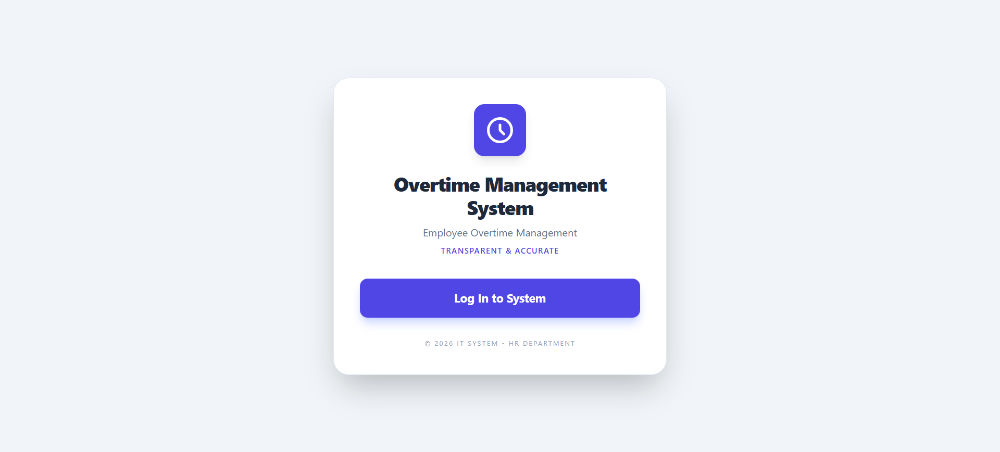
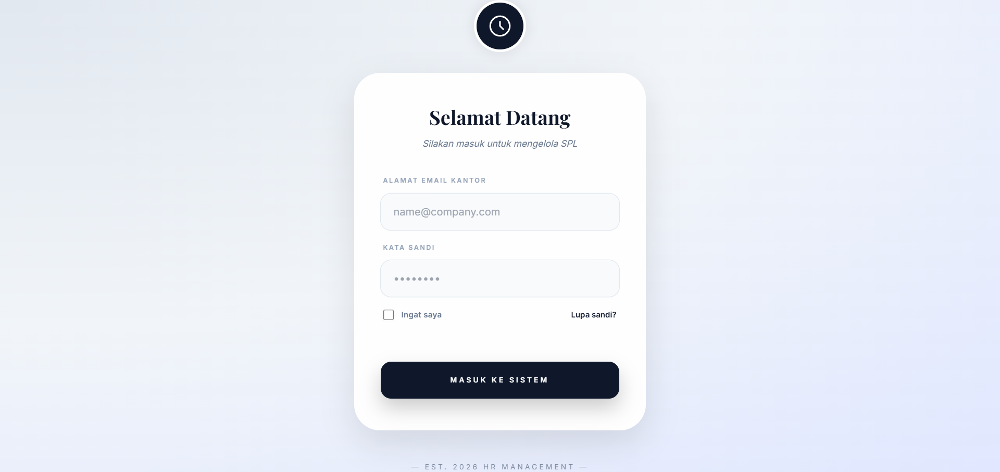
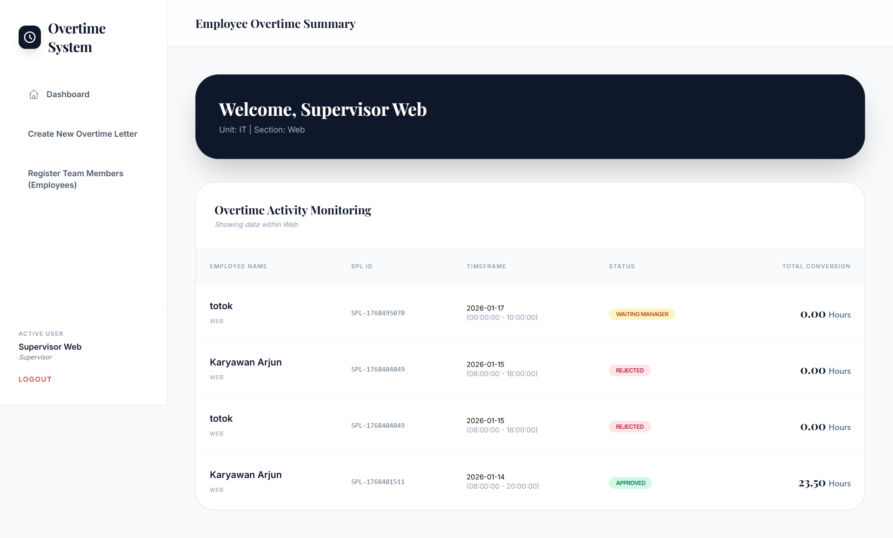
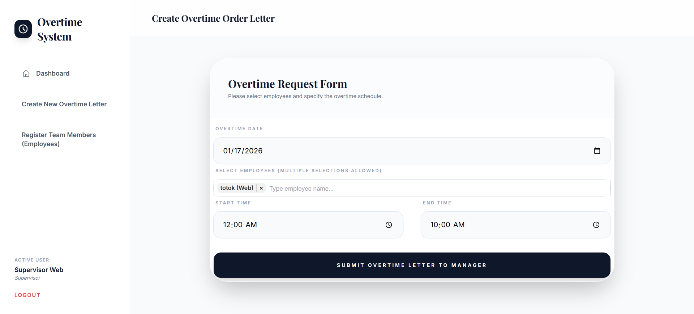
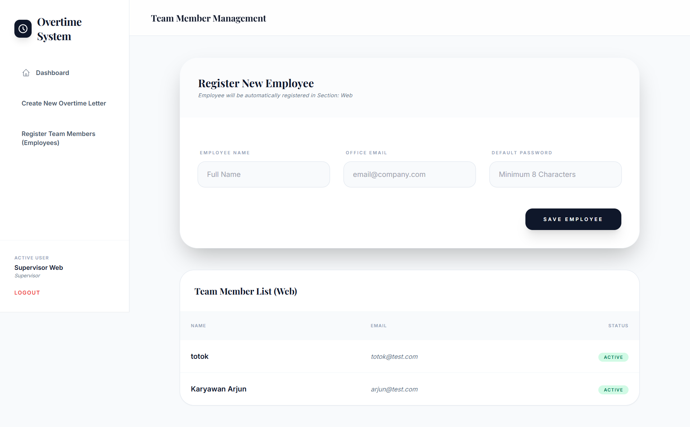
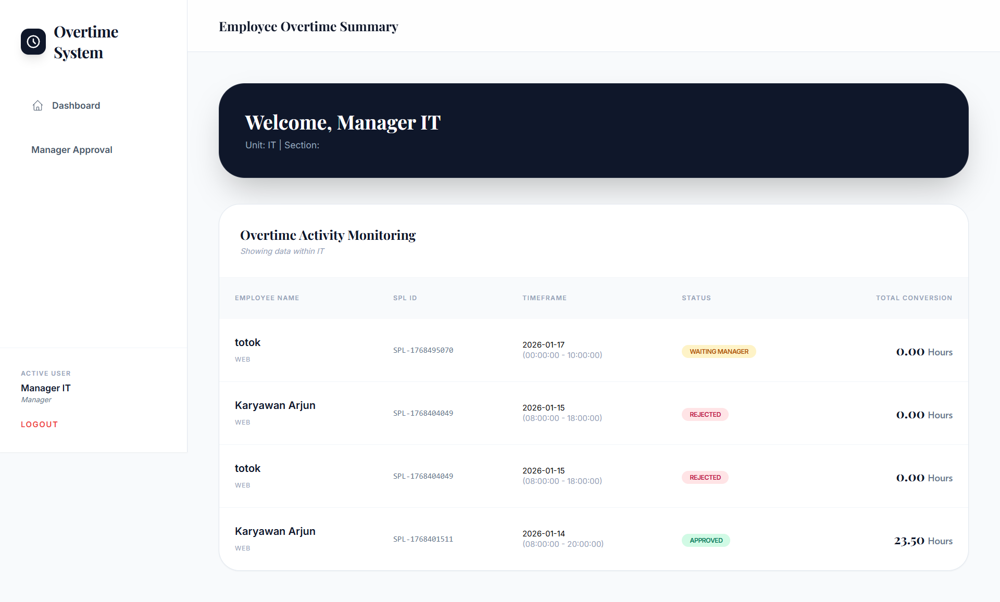
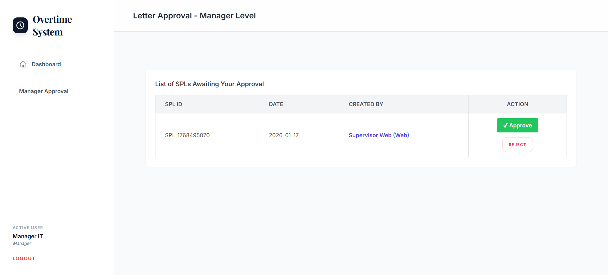
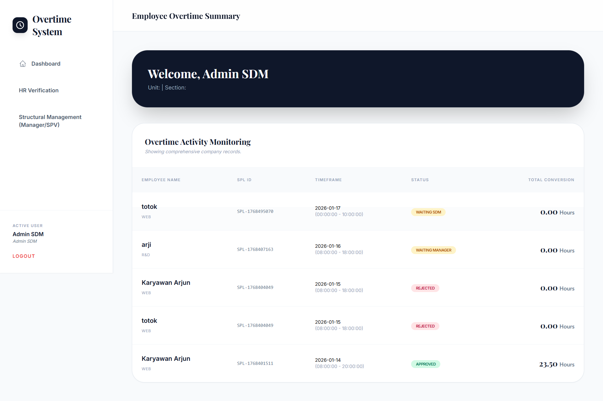
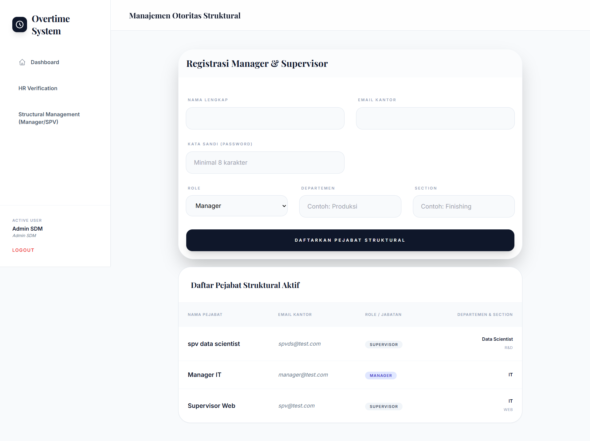
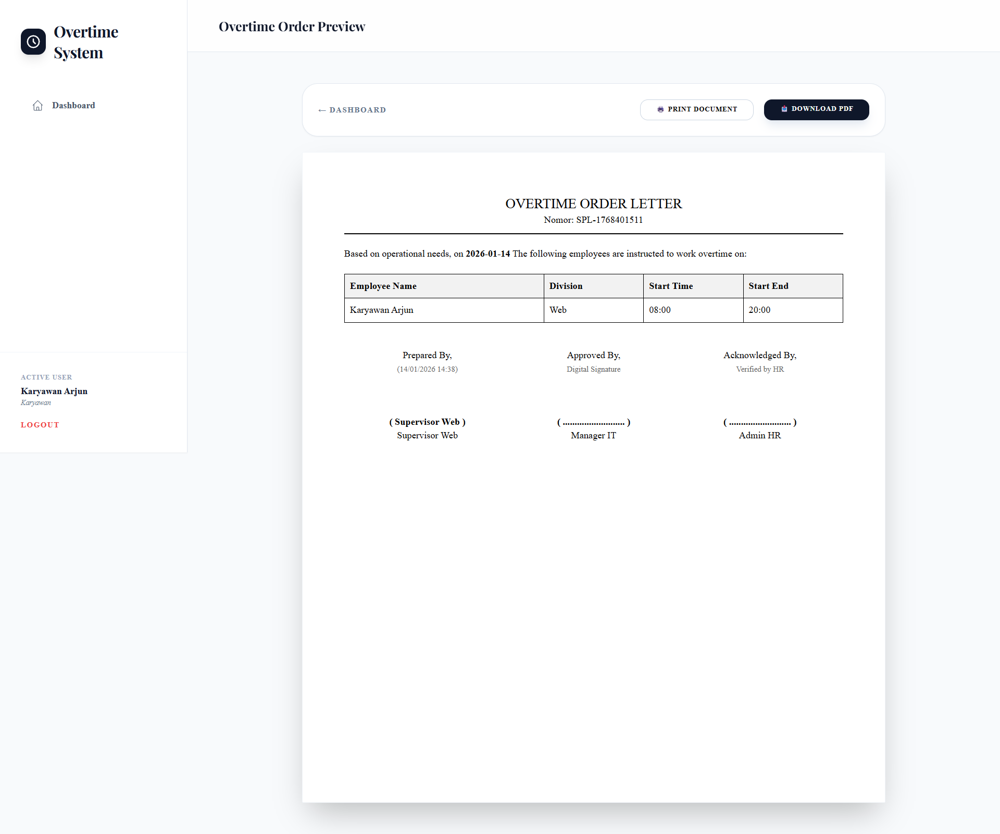

# 🕰️ SPL System (Overtime Order System)

A hierarchical overtime management system designed for corporate efficiency. Seamlessly connecting Employees, Supervisors, Managers, and HR Admins in an elegant digital workflow.
---
## 🛠️ Tech Stack

Built using a modern technology ecosystem to ensure performance, security, and scalability:
| Category | Technology | Badge |
| :--- | :--- | :--- |
| **Framework** | Laravel 12.44.0 |  |
| **Language** | PHP 8.3.6 |  |
| **Styling** | Tailwind CSS |  |
| **Database** | MySQL |  |
| **Server** | Apache/Nginx |  |
| **Frontend Tool** | TomSelect |  |
---

## ✨ Core Features

### 👑 HR Admin (Central Authority)
- **Structural Management**: Register and manage Manager and Supervisor accounts across different business units.
- **Final Verification**: Perform administrative validation before data is processed for payroll.
- **Global Monitoring**: Real-time tracking of all overtime activities across the company.

### 👨‍💼 Manager (Policy & Approval)
- **Hierarchical Approval**: Review, approve, or reject overtime requests submitted by Supervisors.
- **Budget Control**: Ensure overtime align with departmental goals and business necessity.

### 👷 Supervisor (Team Operations)
- **Authority Delegation**: Independently register team members (Employees) within their specific section.
- **SPL Initiation**: Create overtime orders using an advanced searchable employee selection system.

### 👤 Employee (End-User)
- **Personal Dashboard**: Track personal overtime history and current approval status.
- **Digital Document**: Preview and print official Overtime Orders (SPL) once fully approved.

---

## 📐 Approval Workflow

1. **Initiation**: Supervisor creates an SPL for one or more employees.
2. **Managerial Approval**: Manager reviews the request with the option to Approve or Reject.
3. **HR Verification**: Once approved by the Manager, HR Admin performs a final administrative check.
4. **Automatic Calculation**: The system calculates hour conversion automatically:
    - Regular Days: 1st hour x 1.5, subsequent hours x 2.
    - Off Days/Holidays: 1-hour rest deduction with tiered multipliers x2, x3, up to x4.

---

## 🚀 Installation

1. **Clone Project**:
   ```
   bash
   git clone 
   ```

2. **Instalansi Dependency**
    ```
    composer install
    npm install && npm run dev
    ```
3. **Environment Configuration**
- Duplicate .env.example to .env.
- Configure DB_DATABASE, DB_USERNAME, and DB_PASSWORD.
- Set SESSION_DOMAIN=null to prevent CSRF 419 errors.

4. **Database Migration**
    ```
    php artisan migrate --seed
    ```

---
## 📸 Screenshot & Preview
> *Click on a section to expand the image*

<details> <summary><b>🖼️ First Page </b></summary> <p align="center"></p> </details>

<details> <summary><b>🖼️ Login Page </b></summary> <p align="center"></p> </details>

<details> <summary><b>🖼️ Supervisor Dashboard </b></summary> <p align="center"></p> </details>

<details> <summary><b>🖼️ Create Overtime Letter </b></summary> <p align="center"></p> </details>

<details> <summary><b>🖼️ Register New Employee </b></summary> <p align="center"></p> </details>

<details> <summary><b>🖼️ Manager Dashboard </b></summary> <p align="center"></p> </details>

<details> <summary><b>🖼️ Manager Approval </b></summary> <p align="center"></p> </details>

<details> <summary><b>🖼️ Monitoring Dashboard (HR Admin) </b></summary> <p align="center"></p> </details>

<details> <summary><b>🖼️ HR Verfivation</b></summary> <p align="center"></p> </details>

<details> <summary><b>🖼️ Management Structural Registration </b></summary> <p align="center"></p> </details>

<details> <summary><b>🖼️ Employee Dashboard </b></summary> <p align="center"></p> </details>

<details> <summary><b>🖼️ Overtime Letter Preview </b></summary> <p align="center"></p> </details>

---


